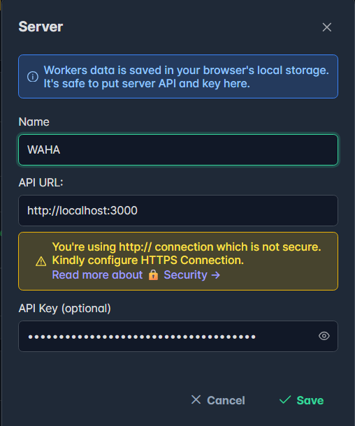
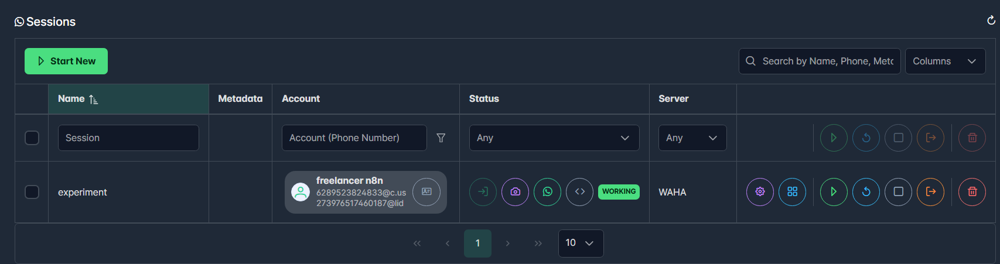
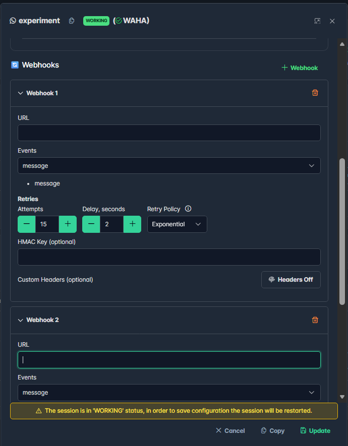
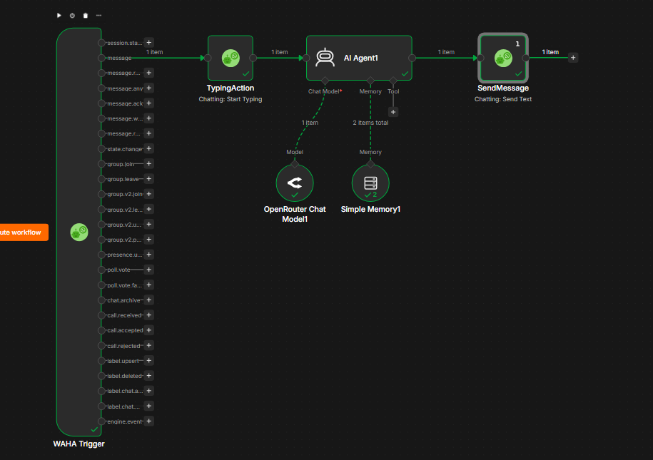

# WhatsApp AI Automation

This repo provides a simple development setup for WhatsApp automation using an unofficial WhatsApp API (WAHA), orchestrated with n8n and exposed locally via ngrok.

## Tech Stack

| Component | Purpose |
|---|---|
| [n8n](https://n8n.io) | Workflow automation & AI Agent orchestration |
| [WAHA](https://waha.devlike.pro) | Unofficial WhatsApp HTTP API (WhatsApp Web based) |
| [ngrok](https://ngrok.com) | Local tunnel for exposing n8n webhook publicly |
| Docker  | Container runtime for all services |


## Prerequisites

- [Docker Desktop](https://www.docker.com/products/docker-desktop/) installed and running
- A WhatsApp number for testing (not your primary daily-driver number is recommended)
- Basic familiarity with terminal/command line

---

## Configuration ⚙️

### 1. Create an ngrok account and get your authtoken

1. Go to [ngrok.com](https://ngrok.com) and sign up for a free account
2. Once logged in, go to **Your Authtoken** in the dashboard sidebar
3. Copy the authtoken shown — you'll need this in step 4

> **Optional but recommended:** ngrok's free tier now offers **1 free static domain**. Go to **Cloud Edge > Domains** in the ngrok dashboard and claim one. A static domain means your webhook URL won't change every time you restart the tunnel — without it, you'll need to update your `.env` and n8n config each time you restart.

### 2. Clone this repo and prepare the project folder

```bash
git clone <this-repo-url>
```

### 3. Copy the environment file template

```bash
cp .env.example .env
```

### 4. Fill in `.env`

Open `.env` and fill in the following:

```env
N8N_DATA_PATH=YOUR_ROOT_DIRECTORY/n8n-data
WAHA_DATA_PATH=YOUR_ROOT_DIRECTORY/waha-data

NGROK_AUTHTOKEN=YOUR_NGROK_AUTHTOKEN
NGROK_DOMAIN=https://YOUR_NGROK_STATIC_DOMAIN
NGROK_STATIC_DOMAIN=YOUR_NGROK_STATIC_DOMAIN

WAHA_API_KEY=GENERATED_YOUR_API_KEY
WAHA_DASHBOARD_USERNAME=CREATED_YOUR_USERNAME
WAHA_DASHBOARD_PASSWORD=CREATED_YOUR_PASSWORD

GENERIC_TIMEZONE=Asia/Jakarta
TZ=Asia/Jakarta
```

> ⚠️ **Never commit your `.env` file.** Make sure it's listed in `.gitignore`.

### 5. Start the stack

```bash
docker compose up -d
```

Check that all three containers are running:
```bash
docker compose ps
```

### 6. Get your ngrok public URL

Open [http://localhost:4040](http://localhost:4040) in your browser. Copy the `https://` forwarding URL shown there.

If you **did not** claim a static domain, this URL will change every time the ngrok container restarts — you'll need to repeat this step and update `.env` accordingly.


### 7. Access n8n and complete first-time setup

1. Open [http://localhost:4040](http://localhost:4040)
2. Click on url given or type manual [http://YOUR_STATIC_DOMAIN]()
3. Create your owner account (email, name, password)
4. n8n is now ready to build workflows in

---

## WAHA Setup

### Dashboard Setup
1. Open [http://localhost:3000](http://localhost:3000)
2. Connect your worker by put your API key on `.env` to worker.  

3. Create session and click on icon camera to login using QR code.

4. Create workflow on n8n.
5. Find Waha Trigger node. Copy test and production url.
6. Go to your Waha dashboard. Click configuration on your session. Add two Webhooks and paste your test and production url

7. Setup waha action on n8n. Find  Waha node (not waha tigger) and create your credential.  
    * host      : `http://waha:3000`
    * api_key   : `YOUR_API_KEY`
8. Then your development setup was ready.  


## Project Structure

```
whatsapp-ai-automation/
├── docker-compose.yml
├── .env.example
├── .env                  
├── README.md
├── n8n-data/               # created automatically      
└── waha-data/              # created automatically
```
